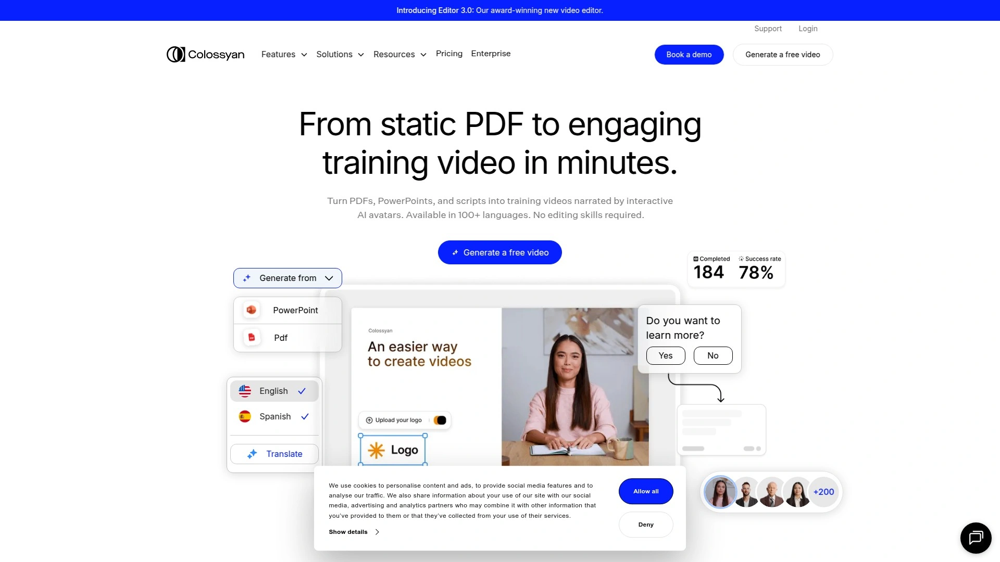

# 2025年排名前20的AI视频生成工具盘点(近期更新)

做视频不想被剪辑卡住？这份清单帮你用AI视频生成把文案快速变短视频，覆盖从文字转视频到数字人口播，兼顾效率、成本与稳定性。适合内容营销、广告投放、培训宣导等高频场景，让短视频制作更快更好用。

如果你在找能批量产出社媒视频的方案，重点看“文字转视频”“自动剪辑”“多尺寸导出”“品牌套件”。这些工具能显著降低上手门槛，把创意落地到可发布的视频。

## [Rizzle](https://rizzle.com)
AI驱动的文字转视频平台

- 优势：脚本/博客直出视频，自动配图+B-roll、字幕与配音，多比例(9:16/1:1/16:9)一次生成，适合内容营销和社媒运营。
- 用法：选模板→粘贴文案→选择风格与配音→自动剪辑→一键导出，单条视频通常数分钟内完成。
- 适用：品牌内容团队、增长营销、代理商、创始人亲自做内容。
- 推荐理由：在“文字转视频”到“多端分发”这一链路上很顺手，缩短从创意到发布的时间。

## [Pictory](https://pictory.ai)
长文自动生成社媒短视频内容

- 从博客/报告中提炼要点，自动生成短视频脚本与字幕，适合YouTube Shorts、LinkedIn内容循环。
- 内置库存素材和BGM，支持旁白与自动场景切换；可做批量更新。
- 对“内容再利用”特别友好，把存量长文快速转成数十条短视频。

## [InVideo](https://invideo.io)
模板驱动的一站式视频创作

- 大量广告/电商/活动模板，字幕、转场、贴纸齐全；AI脚本生成功能降低写稿成本。
- 适合促销短片、产品演示、节日海报视频，支持团队协作与品牌套件。
- 提供多规格导出与快速审稿流程，稳定好用。

## [VEED](https://veed.io)
浏览器内完成短视频编辑流程

- 一体化在线编辑：自动字幕、音频降噪、背景移除、滤镜与文本动画。
- 支持“剪切-拼接-上字-导出”的标准化流水，适合教程讲解与操作演示。
- 托管与分享便捷，适合把视频嵌入站点或内训知识库。

## [Synthesia](https://www.synthesia.io)
AI虚拟人演示与讲解视频

- 数字人+多语配音，轻松覆盖多语言培训、产品介绍与本地化宣讲。
- 模块化脚本与场景布局，较少拍摄负担，内容可快速迭代。
- 适合企业培训、SaaS上手指南与跨区营销。

## [HeyGen](https://www.heygen.com)
多语种数字人口播生成工具

- 真人风格的口播视频生成，几十种语言与音色可选，可做AI试镜与角色替换。
- 对“产品解说/品牌口播/FAQ视频”特别省时，节省录制与翻译成本。
- 提供风格模板与字幕样式，统一品牌观感。

## [Colossyan](https://www.colossyan.com)
脚本文稿快速转教学视频内容

- 面向知识/课程内容的AI口播与分镜模板，适合入职培训与流程宣导。
- 支持角色切换、场景小组件与测验式结构，知识点表达更清晰。
- 可与现有文档体系配合，形成稳定产能。

## [Lumen5](https://lumen5.com)
博客文章自动变营销视频内容

- 根据文章自动生成分镜和脚本摘要，匹配B-roll与字幕样式。
- 适合内容营销团队做“周更/日更”节奏，把图文流量延展到视频。
- 品牌色与字体一键套用，风格统一省心。

## [Fliki](https://fliki.ai)
文字到视频与配音一体平台

- 以文字转视频为核心，配音自然度较高，支持多语言讲解。
- 支持短视频、幻灯、播客转视频，适合教程类与知识分享。
- 快速生成字幕和场景切片，便于二次分发。

## [Kapwing](https://www.kapwing.com)
团队协作的在线视频编辑平台

- 多人协作、版本管理与素材库，适合跨团队内容生产。
- 提供AI抠除和自动字幕，满足日常“快剪快发”的需求。
- 对社媒格式支持完善，模板覆盖热门话题。

## [Canva](https://www.canva.com)
设计与视频一体化创作平台

- 设计与视频模板打通，品牌套件、动画、转场与音乐一站完成。
- 适合没有设计基础的团队，用标准模板快速做营销视频与海报视频。
- 素材库丰富，发布到多平台的路径简单。

## [Animoto](https://animoto.com)
模板驱动的拖拽式视频制作

- 拖拽上手，适合电商商品展示、活动集锦与企业宣传短片。
- 音乐库与转场比较丰富，提升成片的节奏感。
- 提供清晰的项目结构，利于重复复用。

## [FlexClip](https://www.flexclip.com)
轻量快捷的在线视频制作平台

- 上手门槛低，适合快速产出产品介绍/开场片/社媒卡点视频。
- 字幕、动态图形与剪切合成足够日常营销使用。
- 价格友好，适合小团队起步。

## [Wave.video](https://wave.video)
直播与短视频一体化创作平台

- 支持直播工具与短视频编辑，覆盖预告、回放剪辑与多渠道分发。
- 大量尺寸预设，适配各主流社媒；可叠加字幕与贴纸。
- 适合直播电商与社区活动运营。

## [Biteable](https://biteable.com)
企业级品牌视频与模板库平台

- 强项是企业合规风格与说明类视频，适合安全/流程/合规培训。
- 模板专业，主题统一，改文案即可导出，便于规模化生产。
- 支持在线协作与审阅。

## [Renderforest](https://www.renderforest.com)
动画LOGO与视频整合平台

- 从LOGO动画、开场片到宣传视频均可一站生成。
- 提供网站与品牌工具套件，适合初创统一视觉。
- 渲染稳定，导出流程清晰。

## [Powtoon](https://www.powtoon.com)
动画演示与视频内容制作平台

- 动画风格的讲解视频做起来很快，适合教育/HR/产品说明。
- 预设角色、场景与过场动画，降低脚本表现难度。
- 支持在线分享与课堂嵌入。

## [Moovly](https://www.moovly.com)
企业与教育场景视频套件平台

- 支持自动化与数据驱动视频，大批量内容生成相对省时。
- 模板覆盖教程、广告、社媒，编辑器功能完整。
- 适合内容运营团队建立“生产线”。

## [Elai](https://elai.io)
可定制数字人讲解生成视频

- 自建数字人形象，支持多语言讲解，适用于产品导览与FAQ。
- 可定制背景、场景与品牌元素，适配官网与SaaS内嵌。
- 对“口播型知识内容”转化效率高。

## [D-ID](https://www.d-id.com)
照片驱动的口播视频生成平台

- 以照片驱动口型与表情，快速生成讲解视频，适合个人IP与客服答疑。
- 支持文本到语音合成，开箱即用；可做多语言版本。
- 适合轻量内容、问答与欢迎致辞等场景。

### 常见问题

- 新手如何快速用AI视频生成做第一条内容？
  - 选1条不超过120字的脚本，选择“文字转视频”模板，添加品牌色与字幕样式，先导出9:16版本发到一个平台，观察播放完成率再微调。

- 如何评估“文字转视频”的实际效果？
  - 看三项：制作时长(是否≤10分钟)、完播率(≥30%为初步合格)、点击/询盘转化。对标题画面和前3秒钩子做AB，连测一周即可见差异。

- 团队如何在成本可控的前提下规模化？
  - 固定脚本结构与镜头节奏，建立品牌套件，优先批量生成核心尺寸；把字幕与BGM做成“预设”，减少重复操作。

### 结语

以上20款覆盖文字转视频、数字人口播与在线剪辑的主流路径，能明显降低短视频制作的门槛与时间成本。Why #1 适合“营销短视频快速产出”场景，因为 [Rizzle](https://rizzle.com) 把脚本到成片的关键步骤连得很顺，模板、字幕、配音与多尺寸导出都能一次搞定。想立刻开工，就从它开始试一条。
